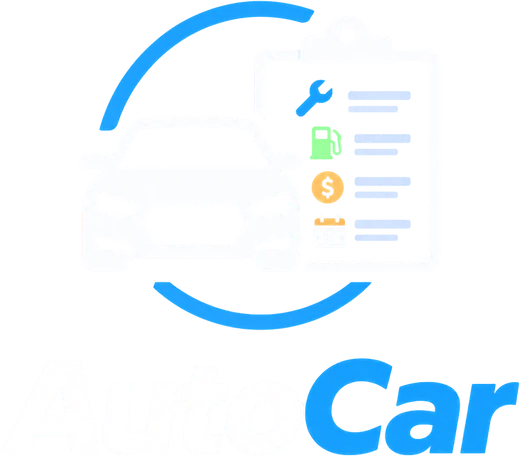
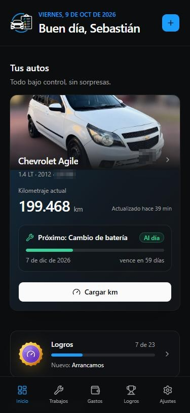
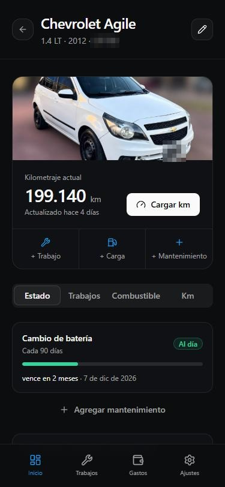
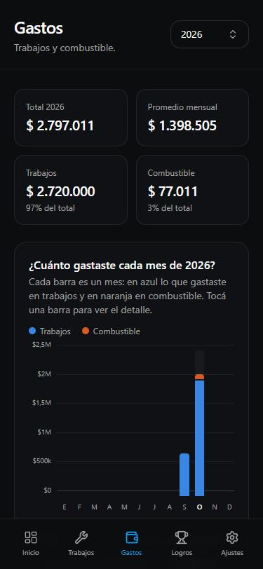
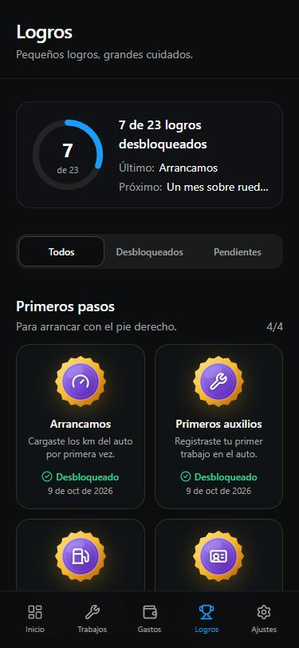
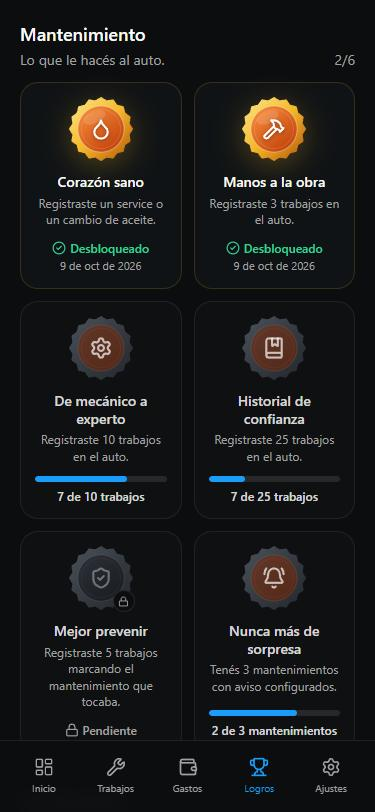

  

# AutoCar

Llevá el mantenimiento de tus autos al día, sin sorpresas.

AutoCar es una app web para el celular (se instala como app) que te avisa cuándo le toca algo al auto, guarda todo lo que le hacés y te muestra cuánto gastás. Pensada para usarla sin vueltas: entrás con tu cuenta de Google, cargás el auto y listo.

  
  
  
  

## Qué podés hacer

### Mantenimientos con aviso

- Cargá cada mantenimiento por km, por tiempo o por los dos: vence **lo que ocurra primero** (service cada 5.000 km o una vez por año, VTV, seguro, correa de distribución…).
- Recordatorios de una sola vez, como "volver al taller en 3 semanas".
- Cada mantenimiento muestra si está **al día, próximo o vencido**, cuánto falta y, según cuánto usás el auto, más o menos qué día vas a llegar a los km.

### Kilometraje

- Cargá los km que marca el tablero. La app calcula cuántos km hacés por semana y con eso estima los vencimientos.
- Un recordatorio semanal (el día que elijas) te pide los km.
- Gráfico de cómo fueron subiendo los km.

### Trabajos e historial

- Registrá lo que le hacés al auto: fecha, km, categoría, costo, taller y notas.
- Marcá qué mantenimientos cumple un trabajo y se reinician solos.
- **Exportá el historial en PDF** para mostrarlo, por ejemplo, al vender el auto. Podés elegir el período y si se ven los costos.

### Combustible

- Autos a nafta, nafta + GNC o gasoil; súper o premium.
- Cargá el precio por litro (o m³) o el total pagado: el resto lo calcula la app.
- Consumo (km por litro, de tanque lleno a tanque lleno), costo por km y el último precio que pagaste de cada combustible.

### Gastos

- Total del año, promedio mensual y gasto de cada mes, separado en trabajos y combustible.
- Gasto por categoría y por auto.

### Logros

  

- 23 medallas que premian la constancia: cargar los km todas las semanas, registrar los trabajos y las cargas, tener los avisos al día.
- Cada logro muestra cuánto falta ("7 de 10 trabajos") y la fecha en que lo conseguiste.
- Una celebración cuando desbloqueás uno (o un resumen si son muchos).
- Premian **anotar**, no gastar más ni usar más el auto. Una vez conseguidos, no se pierden.

 

### Y además

- **Varios autos** por cuenta, cada uno con su foto.
- **Notificaciones** en el celular cuando un mantenimiento está por vencer o se venció (en iPhone, con la app agregada a la pantalla de inicio).
- **Funciona sin señal**: lo que cargás en la estación de servicio se guarda y se sincroniza cuando vuelve la conexión.
- **Antes de guardar o borrar, la app te pide que confirmes**, y casi todo lo que borrás se puede deshacer.
- Tus datos son tuyos: cada cuenta sólo puede ver y cambiar lo suyo.

## Hecho con

Next.js · Tailwind CSS · Firebase (login con Google y base de datos) · Cloudinary (fotos) · Web Push · Vercel.

El [manual de usuario](docs/manual-de-usuario.pdf) explica paso a paso cómo usar la app, listo para imprimir.

Para correrlo, configurarlo o publicarlo, mirá [INSTRUCTIONS.md](INSTRUCTIONS.md).

## Licencia

[MIT](LICENSE). Si querés participar, leé el [código de conducta](CODE_OF_CONDUCT.md).
